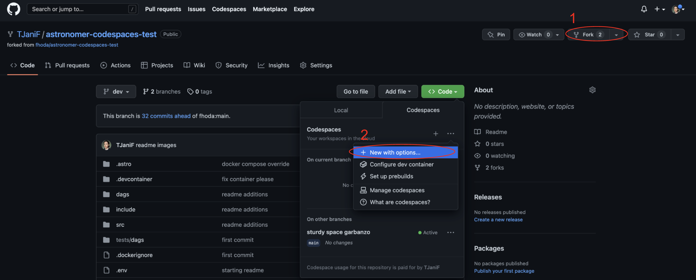
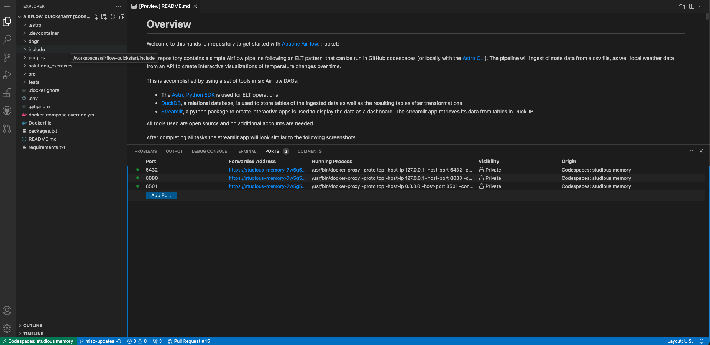

Overview
========

Welcome to the Mars Probe Demo! This demo will allow you to walk through the UI, run backfills, test DAG versioning, and simulate remote execution. This demo is self-contained, so there is not any actual remote connections, or other external resources needed. 

Project Contents
================

Your Astro project contains the following files and folders:

- dags: This folder contains the Python files for your Airflow DAGs.
    - mars_probe: Collects data, pre-processes the data, then pushes to Snowflake DB.
          - This will show up in Airflow as "2 DAGs": collect_probe_data, and preprocess_probe_data
    - earth_analysis: Grabs data from Snowflake DB and Analyzes it. 
    - remote_probe: Simulates remote task execution
    - example_astronauts: Created by Astro CLI when you initialize the project. A good example DAG, but not needed for the Mars demo. 
- Dockerfile: This file contains a versioned Astro Runtime Docker image that provides a differentiated Airflow experience. If you want to execute other commands or overrides at runtime, specify them here.
- include: This folder contains any additional files that you want to include as part of your project. It is empty by default.
- packages.txt: Install OS-level packages needed for your project by adding them to this file. It is empty by default.
- requirements.txt: Install Python packages needed for your project by adding them to this file. It is empty by default.
- plugins: Add custom or community plugins for your project to this file. It is empty by default.
- airflow_settings.yaml: Use this local-only file to specify Airflow Connections, Variables, and Pools instead of entering them in the Airflow UI as you develop DAGs in this project.

Setting Up
==========

### Option 1: Use GitHub Codespaces

Run this Airflow project without installing anything locally.

1. Fork this repository.
2. Create a new GitHub Codespaces project on your fork. Make sure it uses at least 4 cores!

    
3. Run this command in the Codespaces terminal: `astro dev init`
4. Run this command in the Codespaces terminal: `astro dev start`
5. The Astro CLI will automatically start up all necessary Airflow components. This can take a few minutes. It will also create a dag "example_astronauts" by default. 
6. Once the Airflow project has started, access the Airflow UI by clicking on the **Ports** tab and opening the forward URL for port 8080.

    

7. Once the app is running, you can access it by by clicking on the **Ports** tab and opening the forward URL for port 8501.

### Option 2: Use the Astro CLI

Download the [Astro CLI](https://docs.astronomer.io/astro/cli/install-cli) to run Airflow locally in Docker. `astro` is the only package you will need to install.

1. Run `git clone -b airflow-3-mars-demo --single-branch https://github.com/astronomer/airflow-3-demos.git && cd airflow-3-demos` on your computer to create a local clone of this repository, and to go into that folder.
2. Install the Astro CLI by following the steps in the [Astro CLI documentation](https://docs.astronomer.io/astro/cli/install-cli). You don't need in-depth Docker knowledge to run Airflow with the Astro CLI.
3. Run `astro dev init` in your cloned repository.
4. Run `astro dev start` in your cloned repository.
5. After your Astro project has started. View the Airflow UI at `localhost:8080`. NOTE: Safari is not currently supported by the Airflow UI. If it automatically opens in Safari, close the tab, and open in Chrome.

Project Navigation
==================

You are free to run this project as you see fit. Whenever you enable and run the `collect_probe_data` dag, it will automatically trigger `preprocess_probe_data` and then `earth_analysis`. The `remote_probe_dag` has no dependencies. 
